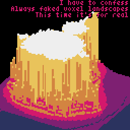

# megademo

A pastime project for recreating some of the demo effects from my childhood that I enjoyed tinkering with. This time instead of going full berzerk on CPU cycle tight optimisation in 6510/6502 and x86 assembly I went for [pyxel](https://github.com/kitao/pyxel) (a super nice and easy to approach retro game engine for Python) because I got lazy :) and it just allows me to quickly capture a bit of nostalgy in between times. You can check out the current version of this little experiment of mine [running in your browser](https://kitao.github.io/pyxel/wasm/launcher/?run=greg76.megademo.megademo)! :wink:





The term megademo was used to refer to longer then usual demoscene product, that would include an extensive range of effects, so called demo parts. Later demos evolved into a more fluid, story telling like visual experience with a more unified look and stronger visual integrity. Early megademos on the other hand were more like just a series of independent parts, sections, a showcase of graphics routines.

## pyxel - the retro game engine under the hood

While programming the good old Commodores or even sometimes the 16 (and later) 32 bit era PCs required you to hand optimise some assembly code to get to the desired performance for specific visual effects, [pyxel](https://github.com/kitao/pyxel) (that is inspired by [pico-8](https://www.lexaloffle.com/pico-8.php)) poses some artificial (and inherit) limitations on what you can build with it.


* 16 color palette. (which you can customise if you want to go for the look and feel of a specific machine, but I'll just stick to the default one depicted above)
* although you do have access to "video memory" but it is still python, so it is preferred that you rely on the the fairly limited, [SDL2](https://www.libsdl.org) backed primitives.
* for pixel based graphics you only have access to 3 banks of 256x256 pixels (and similarly sized tilemaps)

What is great about pyxel, that due to it's ability to create wasm ouput, you can very easily make your game/demo run in a browser as well. Basically you just need to link to the python file, which is amazing!

## Development environment

To be able modify and run the demo you will need:

* Pyhton 3.7+ (3.10 is recommended for performance purposes, just in case)
* [pipenv](https://pipenv.pypa.io/en/latest/index.html) (to be frank, this is optional. pipenv just happens to be my choice of tool for managing virtual environments for it's simplicity and keeping my work folder clean)
* [pyxel](https://github.com/kitao/pyxel) python package is basically the only dependency
* in the development workflow I also like to use [black](https://github.com/psf/black) for code formatting, but that is purely optional.

Steps for setting up the environment once creating the folder and downloading the contents of this repository (presuming you already have [homebrew](https://brew.sh) installed):

```
brew install python@3.10
brew install pipenv
pipenv install
```

For running the demo in the same folder your would want to

```
pipenv run python3 megademo.py
```
(VS Code will/can recognise the virtual enviroment for python and you should be able to run it just by clicking on the "Run Python file" button.)